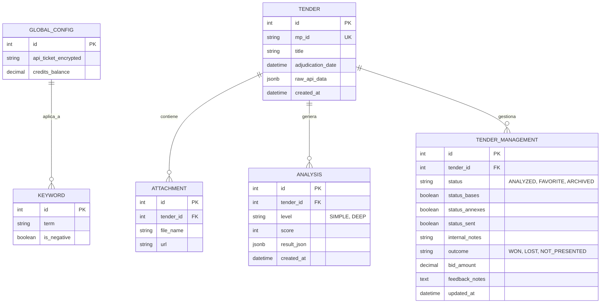
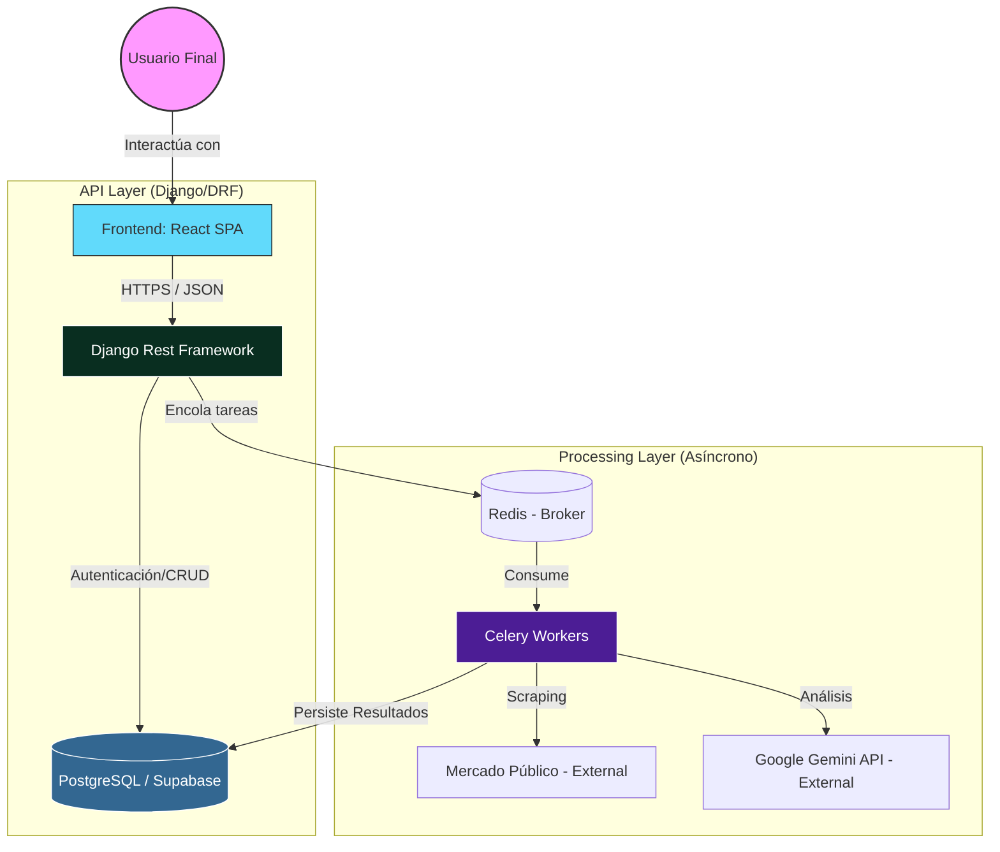

# PROYECTO: LicitAI (SaaS de Inteligencia para Licitaciones)
## 1. DESCRIPCIÓN GENERAL
LicitAI es una plataforma diseñada para optimizar y automatizar el proceso de búsqueda, análisis y gestión de licitaciones públicas (Mercado Público, Chile). El sistema utiliza Scraping avanzado y Modelos de Lenguaje de Gran Escala (LLM - Gemini) para transformar fichas técnicas y documentos anexos complejos en insights estratégicos accionables.

El valor central reside en filtrar el ruido del portal público, asignando un Scoring de Relevancia personalizado y detectando riesgos ocultos en las bases administrativas, permitiendo participar solo en las oportunidades con mayor probabilidad de éxito.

## 2. PILARES TECNOLÓGICOS (STACK)
Frontend: React.js (Vite) + TailwindCSS + TanStack Query (React Query) para gestión de estado, caché y sincronización de datos asíncronos.

Backend: Django 5.x + Django Rest Framework (DRF).

Base de Datos: PostgreSQL (Supabase).

Procesamiento Asíncrono: Celery + Redis (para Scraping Nivel 2 y tareas de IA).

IA: Google Gemini (vía API/SDK) con enfoque en extracción estructurada (JSON Mode).

Seguridad: Cifrado AES-256 para credenciales de terceros (Ticket API).

## 3. FLUJO DE VALOR (PIPELINE)
Descubrimiento (Batch/On-demand): Sincronización con la API de Mercado Público basada en Keywords globales.

Análisis Nivel 1 (Ficha): Evaluación rápida de la ficha técnica para descarte inmediato.

Análisis Nivel 2 (Bases/Profundo): Scraping de documentos adjuntos y análisis de cláusulas críticas (multas, plazos, garantías).

## 4. INGENIERÍA DE REQUISITOS
### 4.1. REQUISITOS DE NEGOCIO (BUSINESS REQUIREMENTS)
BR-01: Operación Single-tenant: El sistema está diseñado para un único perfil operativo. Toda la configuración de keywords y análisis es global para la instancia.

BR-02: Gestión de Cuotas: Controlar los costos operativos limitando los análisis de IA diarios.

BR-03: Optimización de Costos de API: Reutilizar análisis existentes de una misma licitación si tienen menos de 24 horas.

### 4.2 REQUISITOS FUNCIONALES (FUNCTIONAL REQUIREMENTS)
#### 4.2.1. Configuración del Sistema
RF-01: Perfil de Búsqueda Dinámico: Interfaz para gestionar "Keywords Positivas" y "Keywords Negativas".

RF-02: Almacenamiento Seguro de Credenciales: Espacio para el Ticket API personal de Mercado Público (cifrado).

#### 4.2.2. Motor de Descubrimiento (Scraper Nivel 1)
RF-03: Sincronización Programada (Batch): Llamada automática cada 24 horas.

RF-04: Sincronización Bajo Demanda: Disparo manual con Throttling (cooldown de 15-30 min) y feedback visual "Sincronizando...".

RF-05: Pre-filtrado Automático: Marcado de licitaciones que coinciden con el perfil de keywords actual.

#### 4.2.3 Extracción y Análisis Profundo (Scraper Nivel 2 + IA)
RF-06: Ejecución Asíncrona: Uso de Celery para no bloquear la UI durante el scraping de adjuntos.

RF-07: Captura Completa de Ficha: Extracción de descripción técnica, anexos, hitos y cláusulas de pago.

RF-08: Mapeo de Documentación: Categorización de links de descarga para acceso directo y análisis de la IA.

RF-09: Scoring de Relevancia: Asignación de puntaje (0-100) según alineación con keywords.

RF-10: Análisis de Factibilidad Inicial (Nivel 1): Resumen automático basado en Ficha HTML.

RF-11: Análisis de Riesgo Profundo (Nivel 2): Navegación a adjuntos y detección de cláusulas críticas en bases.

RF-12: Auditoría de Análisis: Citas específicas del texto original en las conclusiones de la IA.

#### 4.2.4. Visualización y Gestión (Dashboard)
RF-13: Estado en Tiempo Real: Progreso del scraper (Navegando, Analizando, Listo).

RF-14: Exportación de Reportes: Generación de PDF resumen.

RF-15: Notificaciones: Resumen de hallazgos vía email al finalizar procesos Batch.

RF-16: Clasificación de Oportunidades: Estados: Analizadas, Favoritas y Archivadas.

RF-17: Pipeline de Preparación: Hitos para Favoritas, (Bases Leídas, Documentación Preparada, Oferta Enviada). Solo se visualizan cuando las licitaciones están en estado de Favoritas.

RF-18: Notas Estratégicas: Campo de texto libre para anotaciones tácticas. Solo se visualizan cuando las licitaciones están en estado de Favoritas.

RF-19: Registro de Resultados: Captura de outcome (Ganada/Perdida), monto y feedback.

RF-20: Interfaz Reactiva: Dashboard desarrollado en React que consume la API REST, gestionando en tiempo real el feedback del estado de los procesos asíncronos (polling de tareas Celery) y visualización dinámica de datos.

#### 4.2.5. Inteligencia de Negocios (Analytics)
RF-21: Dashboard de Performance: Tasa de conversión, Embudo de ventas y Análisis de valor (montos adjudicados vs perdidos).

### 4.3. REQUISITOS NO FUNCIONALES (NON-FUNCTIONAL)
RNF-01: Concurrencia: Soporte de 5 workers de Selenium simultáneos.

RNF-02: Latencia de IA: Timeout máximo de 60 segundos por análisis.

RNF-03: Resiliencia: Reintentos con Backoff para fallos de DOM en el scraper.

RNF-04: Gestión de Secretos: Cifrado AES-256 para el api_ticket y variables de entorno para llaves maestras.

### 4.4. REQUISITOS DE DATOS
#### 4.4.1 Diccionario de Entidades (Single-Tenant)
##### E1: Configuración Global

GlobalConfig: Almacena el API_Ticket (cifrado) y parámetros generales del sistema.

Keyword: Términos de búsqueda (positivos/negativos).

##### E2: Licitación (Tender) y Adjuntos

Tender: Datos crudos (mp_id, metadatos, JSON de la API).

Attachment: URLs y tipos de documentos asociados.

##### E3: Inteligencia y Gestión

Analysis: Resultados del LLM (score, result_json, level).

TenderManagement: Estado en el pipeline, notas, hitos de preparación y resultados finales.

## 5. DIAGRAMA ENTIDAD RELACIÓN

## 6. DISEÑO DE RUTAS DE API (SINGLE-TENANT)
### 6.1 MÓDULO DE CONFIGURACIÓN
GET / PATCH | /api/config/: Gestionar Ticket API y parámetros globales.

GET / POST / DELETE | /api/keywords/: Administrar términos de búsqueda.

### 6.2 MÓDULO DE LICITACIONES Y DESCUBRIMIENTO
GET | /api/tenders/: Feed principal filtrado.

GET | /api/tenders/{id}/: Detalle y adjuntos.

POST | /api/tenders/sync/: Disparo manual de sincronización.

### 6.3 MÓDULO DE INTELIGENCIA
POST | /api/analysis/deep/{id}/: Solicitar Análisis Nivel 2 (Asíncrono).

GET | /api/analysis/status/{task_id}/: Estado de la tarea Celery.

GET | /api/analysis/report/{id}/: Reporte completo con citas.

### 6.4 MÓDULO DE GESTIÓN Y ANALYTICS
PATCH | /api/management/{id}/: Actualizar estado, hitos o notas.

POST | /api/management/{id}/result/: Cierre de oportunidad (Win/Loss).

GET | /api/analytics/dashboard/: KPIs de performance y embudo.

## 7 DIAGRAMA DE ARQUITECTURA DE SOFTWARE

## 8. ESTÁNDARES DE CODIFICACIÓN Y DOCUMENTACIÓN
### 8.1. Estilo y Formato
- **PEP 8:** Adherencia estricta al estándar de estilo de Python.
- **Espaciado:** Dos líneas en blanco entre clases y funciones de nivel superior.

### 8.2. Documentación de Código
- **Docstrings:** Obligatorios para todas las clases y funciones principales, describiendo su propósito general.
- **Comentarios Internos:** Uso de `#` para documentar campos de modelos, lógica compleja o decisiones técnicas específicas.
- **Modelos Lean:** Evitar el uso de clases `Meta` y parámetros `help_text` en los modelos para mantener la legibilidad, prefiriendo comentarios de Python para la descripción de campos.

### 8.3. Gestión de Secretos
- **Variables de Entorno:** Prohibido hardcodear credenciales. Uso obligatorio de `.env` y la librería `python-dotenv`.
- **Cifrado:** Información sensible (como el Ticket API) debe almacenarse cifrada en la base de datos.